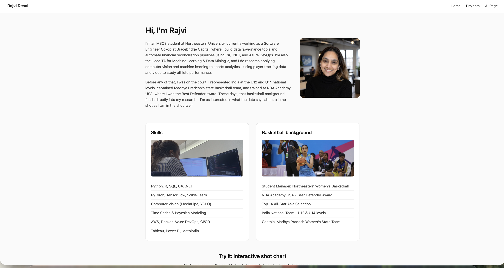

# Rajvi Desai — Personal Homepage

## Author
Rajvi Desai

## Class
[CS5610 Web Development — Northeastern University]

## Project objective
A personal homepage built with vanilla HTML5, CSS3, and ES6+ for CS5610
Project 1. The site highlights my work in machine learning and sports
analytics alongside a competitive basketball background, including an
interactive shot chart as a creative addition.

## Screenshot

## Instructions to build

This is a static site with no build step or dependencies to install.

1. Clone the repo
2. Open `index.html` with a local server 
3. Navigate between Home, Projects, and the AI-generated page using the
   nav bar

## Pages

- `index.html` — homepage (hand-built)
- `projects.html` — projects & experience (hand-built)
- `ai-generated.html` — resume-style page (AI-generated, see below)

## Creative addition

An interactive basketball shot chart on the homepage - click anywhere on
the SVG half-court to "take a shot." Make/miss odds are weighted by
distance from the hoop, and a live stats bar tracks shots, makes, and
shooting percentage.

## Use of GenAI

**Model used:** Claude (Anthropic), Sonnet 5 (Medium), via claude.ai

**How it was used:** Claude was used throughout this project for code review/debugging on the hand-built pages, and to
generate the third page (`ai-generated.html`) end-to-end, per the
assignment's instructions to build one page purely from AI generation
while building the first two by hand.

**Process for the AI-generated page:** Following guidance from the class
sync session, the page was built with a plan-first, iterative approach -
a plan was proposed and approved before any code was generated, and the
result went through many rounds of review and revision rather than being
accepted as a single output.

Major prompts given for the ai-generated page are:

**Prompt:**
> I'm building a third page for my personal portfolio site, and I want it
> to work as an online resume/CV page. Here's my existing CSS file so you
> understand my site's visual style: [contents of main.css]. And here's
> the structure of one of my existing pages, projects.html: [contents of
> projects.html]. Here's my resume content to use (education, experience,
> skills, basketball background): [resume content, omitting personal
> contact details]. I want this page to read as a clean, scannable
> resume, not casual or playful. It should include sections for
> Education, Experience, Skills, and my Basketball background, all pulled
> from the content above. It needs to visually and structurally match my
> existing site exactly - same nav bar, same footer, same color accent,
> same card and section styles, not a new design. Use the exact same
> navbar and footer as projects.html. Follow these technical rules:
> vanilla HTML5 and CSS3 only, no Bootstrap, no jQuery, any JavaScript
> must use ES6 modules, use flexbox not tables, use real semantic HTML
> elements, all images need alt text, include meta tags for author and
> description. For the output, give me a single HTML file called
> ai-generated.html, any new CSS rules added to a new file 
> reusing existing classes wherever possible, and if you add any
> JavaScript, put it in its own file, loaded as an
> ES6 module. Before writing any code, propose a plan - what sections, in
> what order, and which of my existing CSS classes you'd reuse for each
> part. Don't write code yet.

**Prompt:**
> That plan works. Generate the actual HTML for ai-generated.html now,
> reusing the CSS classes from the file I pasted above so it matches the
> rest of my site exactly.

**Prompt:**
> Add a one-line professional summary under the main heading, tying
> together my ML background and basketball experience.

**Prompt:**
> Split the flat skills list into categorized sub-groups: Languages,
> Machine Learning, Infrastructure, Visualization, matching how they're
> grouped in the resume I pasted earlier.

**Prompt:**
> Double check the basketball section against the resume I gave you - I
> think something's missing.

**Prompt:**
> Check the heading hierarchy across the whole page and fix it so it's
> strictly sequential, h1 to h2 to h3, no skipped levels.

**Prompt:**
> Add one small, original JavaScript feature to this page, something
> simple and useful for a resume page, using an ES6 module with
> type="module".

**Prompt:**
> Add an aria-label to the nav bar for accessibility.

**Prompt:**
> Standardize dash usage across the page, en dash for date ranges, em
> dash for standalone separators.

**Prompt:**
> Add a "last updated" line before the footer.

**Prompt:**
> Remove any redundant or empty tags, and make sure the class names match
> projects.html exactly.

**Prompt:**
> Do one final check: confirm there's no Bootstrap or jQuery anywhere, no
> !important in the CSS, no non-semantic tags, and that the JS feature is
> more than 5 lines and uses type="module".

## License

MIT