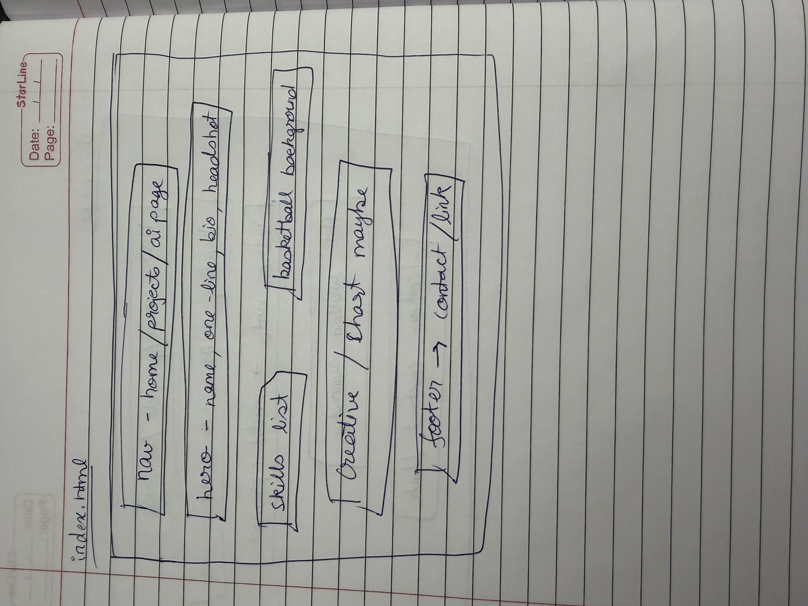
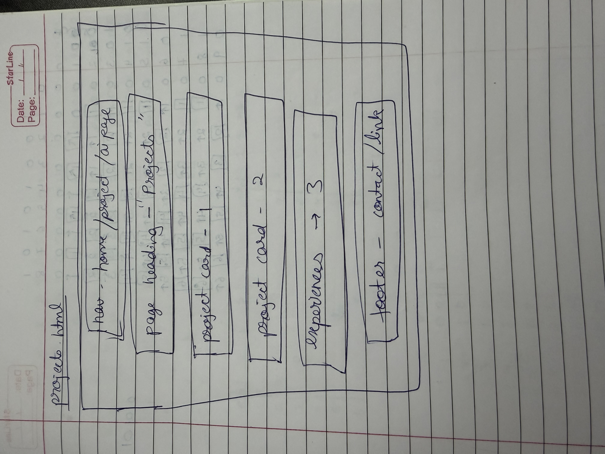

# Design document - Rajvi's personal homepage

## Project description

This is a personal homepage for Rajvi Desai, a Master's student in Computer
Science at Northeastern University. The site highlights an unusual
combination of background: data science / machine learning experience
(particularly in sports analytics) alongside a genuine competitive
basketball career, including time at NBA Academy USA and on India's
national youth teams.

The goal of the page is to give visitors(recruiters, coaches, or
classmates) a quick, honest picture of both sides of that background, plus
a small interactive feature (a basketball shot chart) that reflects the
overlap between the two.

## User personas

**Jesse, a technical recruiter at a sports analytics company.**
Needs to quickly verify Rajvi's ML/DS skills and see relevant project
work, ideally without digging through a resume PDF first.

**Coach Daniels, a college basketball coach exploring analytics tools.**
Wants to see that Rajvi has both real basketball experience and the
technical skill to build tools coaches would actually use.

**Alex, a fellow MSCS classmate.**
Browsing for project inspiration or considering a group project
collaborator, wants to quickly see what technologies Rajvi has worked
with.

## User stories

- As a technical recruiter, I want to see Rajvi's ML skills and project
  outcomes right on the homepage, so I can decide whether to reach out
  without needing a resume first.
- As a basketball coach interested in analytics, I want to see that Rajvi
  has both real playing experience and the technical skill to build
  useful tools, so I can trust her sports-specific insight.
- As a classmate, I want to quickly see what technologies Rajvi has used
  and find a way to contact her, so I can consider her for a group
  project.

## Design mockups

### Homepage (`index.html`)

Nav bar at the top, a hero section with name/bio/photo, a two-column
section for skills and basketball background, the interactive shot chart
(creative addition) below that, and a footer with contact links.

### Projects page (`projects.html`)

Nav bar, a page heading, then a stacked list of project/experience cards
(the basketball prediction model, the shot analyzer, and work experience),
followed by a footer.

### AI-generated page (`ai-generated.html`)

No wireframe was created for this page on purpose. Since the entire point
of this page is to compare hand-built work against something generated
entirely from a prompt, sketching a layout in advance would mean dictating
the design rather than actually testing what AI produces on its own. The
layout and content of this page are left fully to the generation prompt
described in the README's GenAI usage section.